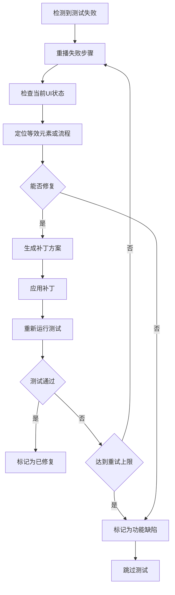
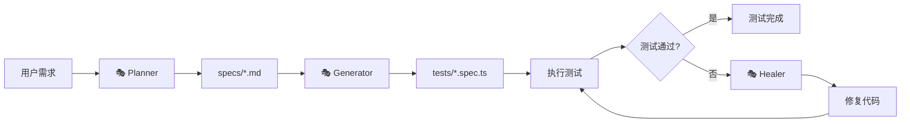
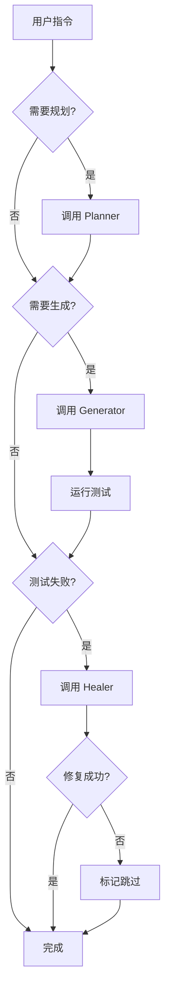
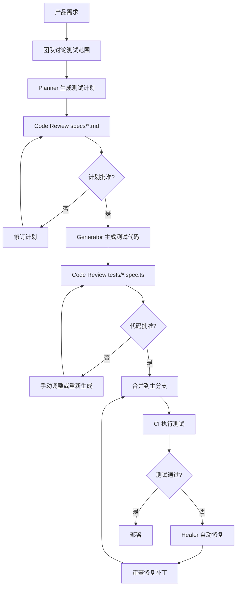

# Playwright Test Agent 框架设计文档

## 项目概述

本框架基于 Playwright 官方的 Test Agents 功能，提供一个自动化测试生成和维护的完整解决方案。框架包含三个核心智能代理（🎭 planner、🎭 generator、🎭 healer），它们可以独立运行、顺序执行或作为链式调用在智能循环中协同工作，实现端到端测试用例的全自动化生命周期管理。

## 核心价值

- **测试规划自动化**：通过探索应用自动生成结构化测试计划
- **测试代码生成**：将人类可读的测试计划转换为可执行的 Playwright 测试
- **自愈能力**：自动检测并修复失败的测试用例
- **团队协作**：提供人类可读的 Markdown 测试计划，便于审查和沟通
- **持续维护**：随应用变化自动调整测试脚本，降低维护成本

## 三大核心代理

### 🎭 Planner（规划代理）

#### 功能职责
探索应用程序并生成一个或多个场景和用户流程的测试计划

#### 输入要求

| 输入项 | 类型 | 必需性 | 说明 |
|--------|------|--------|------|
| 规划请求 | 文本指令 | 必需 | 明确的测试场景描述（如"为访客结账生成测试计划"） |
| 种子测试 | seed.spec.ts | 必需 | 建立与应用交互所需的环境配置，包括全局设置、项目依赖、fixtures 和 hooks |
| 产品需求文档 | PRD文档 | 可选 | 提供业务上下文和功能说明 |

#### 执行策略
- 运行种子测试以初始化测试环境
- 探索应用的用户界面和交互流程
- 识别关键操作路径和边界条件
- 将业务流程分解为可测试的步骤

#### 输出产物
生成保存在 `specs/` 目录下的 Markdown 格式测试计划，内容包括：
- 应用程序概述
- 测试场景分类
- 详细操作步骤
- 预期结果描述
- 数据要求

#### 测试计划结构

Markdown 文件遵循以下层次结构：

```
# 应用名称 - 测试计划标题

## 应用程序概述
[应用功能和特性的高层描述]

## 测试场景

### 场景 1: [场景名称]
**种子：** tests/seed.spec.ts

#### 1.1 [用例名称]
**步骤：**
1. [具体操作步骤]
2. [...]

**预期结果：**
- [断言点 1]
- [断言点 2]
```

---

### 🎭 Generator（生成代理）

#### 功能职责
将 Markdown 测试计划转换为可执行的 Playwright 测试代码

#### 输入要求

| 输入项 | 类型 | 必需性 | 说明 |
|--------|------|--------|------|
| 测试计划 | Markdown文件 | 必需 | 来自 `specs/` 目录的测试计划文件 |
| 种子测试引用 | 文件路径 | 必需 | 继承种子测试的配置和 fixtures |

#### 执行策略
- 解析 Markdown 文件中的步骤和断言
- 实时验证选择器的有效性
- 利用 Playwright 的断言目录进行结构和行为验证
- 使用生成提示优化测试质量
- 遵循种子测试的代码风格和模式

#### 输出产物
在 `tests/` 目录下生成 TypeScript 测试文件，具有以下特征：
- 一对一映射测试计划中的场景
- 包含注释关联源 spec 和 seed 文件
- 使用 Playwright 最佳实践的选择器和断言
- 可能包含初始错误（由 healer 修复）

#### 代码生成规范

生成的测试文件遵循以下结构：

- **文件头注释**：标注来源 spec 和 seed 文件
- **导入声明**：引入必要的 fixtures 和工具函数
- **测试套件**：使用 `test.describe` 组织相关用例
- **测试用例**：使用 `test()` 定义独立测试
- **步骤注释**：保留原始步骤描述便于追溯
- **断言注释**：明确标注预期结果验证点

---

### 🎭 Healer（修复代理）

#### 功能职责
自动检测和修复失败的测试用例

#### 触发条件
当测试执行失败时自动激活

#### 修复流程



#### 修复策略

| 失败类型 | 修复方案 |
|---------|---------|
| 选择器失效 | 更新定位器以匹配当前UI结构 |
| 时序问题 | 添加或调整等待条件 |
| 数据不匹配 | 修正断言中的预期值 |
| 元素不可见 | 调整交互前的可见性检查 |
| 流程变更 | 重新排列操作步骤顺序 |

#### 输出结果
- **成功修复**：更新测试文件并通过执行
- **无法修复**：将测试标记为 `skip`，并建议人工介入（可能是功能缺陷）

#### 安全机制
- 重试次数限制（防止无限循环）
- 变更审计日志（记录所有自动修改）
- 关键断言保护（不自动修改业务逻辑验证）

---

## 项目结构约定

框架遵循清晰的目录结构和命名规范：

```
项目根目录/
├── .github/                    # 代理定义文件（由 Playwright 生成，随版本更新）
│   ├── copilot-instructions.md   # GitHub Copilot 代理配置
│   ├── .clinerules               # Cline 代理规则
│   └── ...                       # 其他 AI 工具配置
├── specs/                      # 测试计划存储目录
│   ├── basic-operations.md     # 示例：基础操作测试计划
│   ├── user-authentication.md  # 示例：用户认证测试计划
│   └── ...
├── tests/                      # 测试代码目录
│   ├── seed.spec.ts           # 种子测试（环境初始化）
│   ├── basic-operations/       # 按功能模块组织
│   │   ├── add-todo.spec.ts
│   │   └── delete-todo.spec.ts
│   └── ...
└── playwright.config.ts        # Playwright 配置文件
```

### 目录职责说明

| 目录/文件 | 职责 | 维护方式 |
|----------|------|---------|
| `.github/` | 存储代理定义和指令 | 通过 `npx playwright init-agents` 自动生成 |
| `specs/` | 存储人类可读的测试计划 | Planner 生成，可手动编辑审查 |
| `tests/` | 存储可执行测试脚本 | Generator 生成，Healer 修复 |
| `seed.spec.ts` | 提供页面上下文和初始化 | 手动创建和维护 |
| `playwright.config.ts` | 全局测试配置 | 手动配置 |

---

## 初始化流程

### 代理定义生成

根据使用的 AI 工具选择对应的初始化命令：

| AI 工具 | 初始化命令 | 说明 |
|---------|-----------|------|
| VS Code | `npx playwright init-agents --loop=vscode` | 需要 VS Code v1.105+（当前在 Insiders 频道） |
| Claude Code | `npx playwright init-agents --loop=claude` | 适用于 Anthropic Claude 集成 |
| OpenCode | `npx playwright init-agents --loop=opencode` | 适用于 OpenCode 编辑器 |

### 执行时机
- 首次项目设置时
- Playwright 版本升级后（获取新工具和指令）
- 更换 AI 工具时

### 生成产物
命令将在 `.github/` 目录下创建或更新代理配置文件，这些文件包含：
- MCP（Model Context Protocol）工具定义
- 代理行为指令
- 任务流程编排规则

---

## 种子测试（Seed Test）规范

### 核心作用
- 提供可复用的页面上下文
- 执行全局设置和项目依赖初始化
- 设置自定义 fixtures 和 hooks
- 作为生成测试的代码风格模板

### 实现要求

种子测试必须满足以下条件：

| 要求项 | 说明 | 示例 |
|--------|------|------|
| 文件位置 | 必须位于 `tests/` 目录 | `tests/seed.spec.ts` |
| 命名约定 | 建议使用 `seed.spec.ts` | - |
| 导入声明 | 引入自定义 fixtures | `import { test, expect } from './fixtures'` |
| 测试定义 | 包含至少一个基础测试 | `test('seed', async ({ page }) => { ... })` |
| 环境就绪 | 测试执行后应用处于可交互状态 | 完成登录、导航到起始页等 |

### 设计模式

种子测试应体现以下模式：

```
测试结构：
├── 导入自定义 fixtures 和配置
├── 定义种子测试用例
│   ├── 执行全局设置
│   ├── 初始化测试数据
│   ├── 导航到起始状态
│   └── 验证环境就绪
└── （可选）导出辅助函数供其他测试复用
```

---

## 工作流程与交互

### 顺序执行模式

完整的测试覆盖生成流程：



### 独立使用场景

| 代理 | 独立使用场景 | 输入示例 |
|------|-------------|---------|
| Planner | 仅需测试设计评审 | "为结账流程生成测试计划" |
| Generator | 已有手写测试计划 | "将 specs/checkout.md 转换为测试代码" |
| Healer | 修复已有失败测试 | "修复 tests/login.spec.ts 中的失败用例" |

### 智能循环模式

在支持的 AI 工具中（如 VS Code Copilot），代理可形成自适应循环：



---

## 提示词（Prompt）最佳实践

### Planner 提示词模板

**结构化请求格式：**

```
为 [应用名称] 生成 [功能模块] 的测试计划

**上下文：**
- 种子测试：tests/seed.spec.ts
- 业务场景：[描述用户流程]
- 测试范围：[功能边界说明]

**要求：**
- 覆盖正常流程和异常情况
- 包含边界值测试
- 考虑不同用户权限
```

**关键要素：**
- 明确包含种子测试文件（或在上下文中附加）
- 提供清晰的功能边界
- 可选附加 PRD 文档提供业务上下文

---

### Generator 提示词模板

**结构化请求格式：**

```
根据测试计划 specs/[文件名].md 生成 Playwright 测试

**上下文：**
- 测试计划：specs/[文件名].md
- 种子测试：tests/seed.spec.ts

**要求：**
- 使用 Role-based 选择器优先
- 包含清晰的步骤注释
- 遵循种子测试的代码风格
```

**关键要素：**
- 明确指定 spec 文件路径（或在上下文中附加）
- 引用相应的种子测试
- 可提供选择器偏好和编码规范

---

### Healer 提示词模板

**结构化请求格式：**

```
修复失败的测试：tests/[文件名].spec.ts

**失败信息：**
[粘贴测试运行错误日志]

**上下文：**
- 最近的UI变更：[如有]
- 数据变化：[如有]
```

**关键要素：**
- 提供完整的错误堆栈信息
- 说明近期可能影响测试的变更
- Healer 会自动重播和检查，无需手动分析

---

## 配置与扩展

### Playwright 配置要点

配置文件 `playwright.config.ts` 应包含以下关键设置：

| 配置项 | 建议值 | 说明 |
|--------|--------|------|
| testDir | `'./tests'` | 测试文件根目录 |
| timeout | `30000` | 单个测试超时时间（毫秒） |
| retries | `2` | 失败重试次数（CI环境） |
| use.baseURL | 应用URL | 简化导航代码 |
| use.trace | `'on-first-retry'` | 失败时记录追踪信息，便于 Healer 分析 |
| reporter | `['html', 'json']` | 生成可视化报告和机器可读日志 |

### 自定义 Fixtures

种子测试中引用的 `./fixtures` 文件应提供：

- **页面状态 Fixtures**：预先登录的页面、特定权限用户等
- **数据 Fixtures**：测试数据生成和清理
- **环境 Fixtures**：数据库连接、API 客户端等
- **断言扩展**：业务领域特定的验证逻辑

### 扩展机制

框架通过以下方式支持定制化：

| 扩展点 | 实现方式 | 应用场景 |
|--------|---------|---------|
| 测试计划模板 | 在 specs/ 中创建参考模板 | 统一团队测试设计风格 |
| 代码生成规则 | 更新代理定义文件 | 遵守组织编码规范 |
| 修复策略 | 配置 Healer 规则 | 定制自动修复的激进程度 |
| 工具集成 | MCP 工具扩展 | 集成自定义测试工具 |

---

## 版本管理与协作

### 文件版本控制策略

| 文件类型 | 纳入版本控制 | 说明 |
|---------|-------------|------|
| `.github/` 代理定义 | 是 | 团队共享代理配置，但标注为自动生成 |
| `specs/` 测试计划 | 是 | 重要的设计文档，需要代码审查 |
| `tests/` 测试代码 | 是 | 核心资产，遵循标准代码审查流程 |
| `seed.spec.ts` | 是 | 手动维护的关键文件 |
| `playwright.config.ts` | 是 | 环境配置 |
| 测试结果和追踪 | 否 | 临时产物，通过 `.gitignore` 排除 |

### 团队协作流程



### 审查要点

**测试计划审查（specs/）：**
- 场景覆盖完整性
- 步骤描述准确性
- 预期结果合理性
- 边界条件考虑

**测试代码审查（tests/）：**
- 选择器稳定性（避免脆弱定位器）
- 断言充分性
- 测试独立性（无依赖顺序）
- 代码可读性

**Healer 补丁审查：**
- 修复是否掩盖真实缺陷
- 选择器变更是否合理
- 是否引入新的不稳定因素

---

## 最佳实践与注意事项

### 种子测试设计原则

1. **最小化原则**：只包含必要的环境初始化，避免复杂业务逻辑
2. **稳定性优先**：使用可靠的选择器和等待策略
3. **可复用性**：将通用设置抽取到 fixtures，而非硬编码在种子测试中
4. **文档化**：注释说明初始化的意图和前置条件

### 测试计划编写建议

1. **原子化步骤**：每个步骤描述单一操作，便于 Generator 转换
2. **明确断言**：清晰描述预期结果，避免模糊表述
3. **数据具体化**：使用具体示例数据，而非抽象描述
4. **分层组织**：合理使用 Markdown 标题层级组织场景

### Healer 使用限制

| 适用场景 | 不适用场景 |
|---------|-----------|
| UI 结构微调导致的选择器失效 | 核心业务逻辑变更 |
| 等待时间不足引起的时序问题 | 功能完全移除 |
| 元素属性微小变化 | 断言逻辑错误 |
| 样式类名更新 | 测试设计缺陷 |

**关键原则**：Healer 修复的变更应始终经过人工审查，避免掩盖真实的应用缺陷。

### 性能优化建议

1. **并行执行**：利用 Playwright 的 workers 配置并行运行独立测试
2. **共享上下文**：使用 `test.describe.configure({ mode: 'serial' })` 和共享 fixtures 减少重复初始化
3. **选择性生成**：针对变更模块生成测试，而非全量重新生成
4. **增量修复**：仅对失败测试运行 Healer，避免不必要的重写

---

## 故障排查指南

### 常见问题与解决方案

| 问题 | 可能原因 | 解决方案 |
|------|---------|---------|
| Planner 生成空计划 | 种子测试未成功运行 | 检查种子测试是否独立可执行；查看 Planner 日志确认环境初始化状态 |
| Generator 生成的测试立即失败 | 选择器在生成时已失效 | 确认应用 UI 稳定；考虑在测试环境而非生产环境运行 Generator |
| Healer 无限循环 | 修复策略与实际问题不匹配 | 检查安全机制配置；手动介入分析失败根因 |
| 代理定义未生效 | AI 工具未识别配置文件 | 确认 `init-agents` 使用的 `--loop` 参数与 AI 工具匹配；重启 AI 工具 |

### 调试策略

**Planner 调试：**
- 检查种子测试日志，确认环境初始化成功
- 使用更具体的提示词缩小探索范围
- 提供参考测试计划作为模板

**Generator 调试：**
- 手动运行生成的测试，查看具体失败点
- 检查 spec 文件中的步骤描述是否明确
- 启用 Playwright 的 `--debug` 模式观察选择器匹配过程

**Healer 调试：**
- 查看 Healer 日志了解尝试的修复策略
- 对比修复前后的代码差异
- 如多次修复失败，手动分析是否为功能缺陷

---

## 未来扩展方向

### 框架演进路线

1. **多语言支持**：扩展 Generator 以生成 Python、Java 等语言的 Playwright 测试
2. **可视化测试计划编辑器**：提供 GUI 工具编辑 specs/ 文件
3. **测试覆盖率分析**：自动识别未覆盖的用户流程
4. **智能测试优先级**：基于代码变更影响分析推荐运行测试子集
5. **跨浏览器差异检测**：自动识别并生成浏览器特定的测试分支

### 集成生态

| 集成方向 | 价值 |
|---------|------|
| CI/CD 平台 | 自动化测试生成和修复流程 |
| 缺陷追踪系统 | Healer 无法修复时自动创建 Issue |
| 测试管理工具 | 同步测试计划和执行结果 |
| APM 工具 | 基于生产环境异常生成回归测试 |

---

## README 文档结构规划

项目根目录的 `README.md` 应包含以下章节：

### 1. 项目简介
- 一句话描述框架价值
- 核心能力概览（三个代理）
- 适用场景说明

### 2. 快速开始
- 前置依赖（Node.js、Playwright 版本要求）
- 安装步骤
- 初始化代理定义
- 创建第一个种子测试
- 运行第一个完整流程

### 3. 核心概念
- 三个代理的职责简述
- 项目结构说明
- 种子测试作用
- specs/ 和 tests/ 的关系

### 4. 使用指南
- 如何使用 Planner 生成测试计划
- 如何使用 Generator 生成测试代码
- 如何使用 Healer 修复失败测试
- 提示词示例

### 5. 配置说明
- playwright.config.ts 关键配置
- 自定义 fixtures 示例
- 代理定义更新方法

### 6. 最佳实践
- 种子测试设计要点
- 测试计划编写技巧
- 代码审查建议
- 性能优化提示

### 7. 故障排查
- 常见问题 FAQ
- 调试方法
- 日志分析

### 8. 示例项目
- TodoMVC 示例链接
- 企业级应用示例（如有）

### 9. 贡献指南
- 如何报告问题
- 如何提交改进建议
- 代码贡献流程

### 10. 许可证与支持
- 开源许可证信息
- 社区支持渠道
- 官方文档链接

---

## README 内容框架

### 标题层级规范

```
# Playwright Test Agent 框架（一级标题：项目名称）

## 核心概念章节（二级标题：主要章节）

### 具体主题（三级标题：章节内细分）

#### 详细说明（四级标题：可选，用于复杂主题）
```

### 代码块使用约定

- **命令行操作**：使用 `bash` 代码块
- **配置文件**：使用 `typescript` 或 `json` 代码块
- **示例提示词**：使用 `text` 或无语言标注的代码块
- **目录结构**：使用 `text` 代码块或 Markdown 列表

### 视觉元素

| 元素类型 | 使用场景 |
|---------|---------|
| 表格 | 配置参数对比、功能矩阵、FAQ |
| 列表 | 步骤说明、要点总结、选项枚举 |
| 引用块 | 重要提示、注意事项、版本要求 |
| 徽章 | 版本号、构建状态、许可证（可选） |
| 图表 | 架构图、流程图（使用 Mermaid 或外部图片） |

### 语言风格

- **简洁性**：每个段落聚焦单一主题
- **可操作性**：提供明确的操作步骤和命令
- **渐进性**：从简单示例到复杂场景
- **完整性**：覆盖从安装到生产的全流程

---

## 附录：术语表

| 术语 | 英文 | 说明 |
|------|------|------|
| 代理 | Agent | 具有特定职责的自动化智能模块 |
| 种子测试 | Seed Test | 提供测试环境初始化的基础测试 |
| 测试计划 | Test Plan / Spec | Markdown 格式的结构化测试设计文档 |
| 选择器 | Locator | 用于定位页面元素的表达式 |
| Fixtures | Fixtures | Playwright 的可复用测试上下文和工具 |
| MCP 工具 | MCP Tools | Model Context Protocol 定义的代理能力接口 |
| 自愈 | Self-Healing | 自动检测和修复测试失败的能力 |
| 智能循环 | Agentic Loop | 多个代理链式协作的自适应执行模式 |

---

## 设计文档版本

- **版本**：1.0
- **最后更新**：基于 Playwright Test Agents 官方文档（https://playwright.dev/docs/test-agents）
- **适用 Playwright 版本**：≥ 1.48（建议使用最新稳定版）
- **文档状态**：初始设计完成，待用户审查
